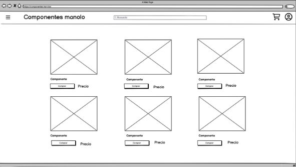
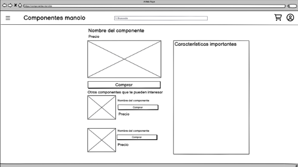
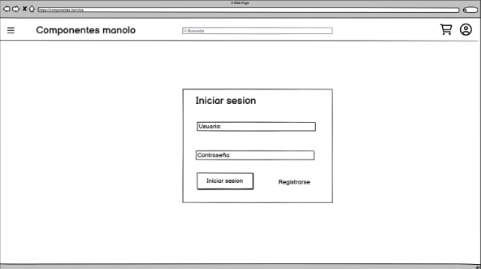
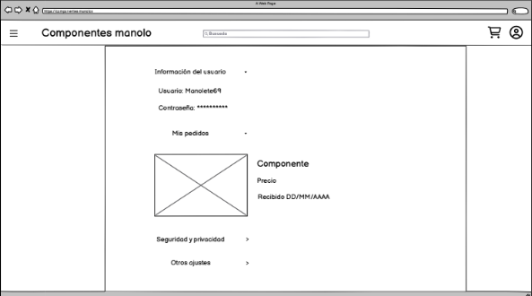

# 1º Análisis de requisitos y objetivos del proyecto:

**Requisitos Funcionales:**

  1º Menu desplegable:
  - Tiene que mostrar los componentes disponibles en la tienda
  - Tiene que ser intuitivo y fácil de usar

  2º Barra de busqueda:
  - Barra de busqueda en el header centrada que te permita buscar los diferentes tipos de productos

  3º Carrito:
  - imagend e un carrito que al clickarla te rediriga a la pagina del carrito con todos los productos añadidos por el usuario.

  4º Usuario:
  - Imagen de usuario que te redirigha a la pagina para iniciar sesion o registrarte y una vez lo haga te mande al menu de usuario

  5º Catalogo de productos:
  - Tiene que mostrar las fotos de los productos, su nombre y producto, ademas de haber un boton que te lleve a la cesta, y cuando clike el nombre o la foto del producto me lleve a su pagina donde vendran todas las caracteristicas

  6º Diseño adaptable:
  - El diseño de la pagina se debe adaptar a la vista de otros dispositivos o tamaños de pantaña

  7º Footer:
  - Pie de pagina con informacion sobre la empresa (aviso legal, redes sociales, entre otra informacion util.)

**Requisitos no funcionales:**

  1º Compatibilidad:
  - Compatible con los diferentes tipos de navegadores
  - Compatible con diferentes tipos de resolucion

  2º Rendimiento:
  - Debe estar optimizado para cargar rapido las paginas

  3º Mantenimiento:
  - El codigo debe estar limpio y organizado

**Tecnologias seleccionadas**

  HTML
  - Esencial para la creacion de cualquier pagina web, algunas de las ventaja que ofrecen son:
    - Sintaxis facil de entender y estructura simple.
    - Lenguaje estandar y compatibles con todos lo navegadores.
    - Facil de aprender.
   
  CSS
  - Esencial para el diseño de cualquier pagina web, algunas de sus ventajas son:
    - Cracion de diseños adaptables a la resolucion
    - Editar el diseño sin la necesidad de tocar el HTML, dejando este aun mas limpio
   
  Herramientas de desarrollo:
  - IDE: Visual Studio Code - Por su compatibilidad con HTML y CSS a travez de una facil instalacion de las extensiones disponibles, personalizacion, facil de usar e intuitivo
  - Validador: Validador de W3C - Que permitia comprobar la entandarizacion del codigo
  - Sistema de control de versiones: GitHub - Que permite llevar un control del progreso del proyecto y sus cambios

# 2º Creación de un wireframe en Balsamiq:

1º Pagina principal

Se decide agregar tambien una seccion donde mostras los producctos que se encuentran de oferta y el footer con la informacion necesaria.

2º Pestaña del producto

Se decide al final realizar un cambio dejando en el lado derecho los productos recomendados y abajo la descripcion y caracteristicas del producto.

3º Pestaña del carrito

Al final se decide cambiar el recuadro para en vez de englobar todos los produtos englobe cada producto un recuadro diferente, ademas de añadir un boton para retirar del carrito el producto.

4º Pestaña de incio de sesion

Se crea tambien una variante para el registro de nuevos usuarios

5º Pestaña de usuario

Se decide que cada opcion este recuadrada y sea despregable, en la seccion pedido se añaden la fecha en la que se realizo y un boton para gestionar incidencias, y se cambian la opcion de otros ajustes por metodos de pago

# 3º Estructura HTML planificada:

**1º Index**

- Lang = "es": Se define el idioma principal al español
- Head:
  - Title: Se define el nombre de la pagina en este caso Componentes Manolo
  - Link: Se linkea el HTML con el CSS para poder hacer el diseño a la pagina
  - Meta: se define la codificacion de los caracteres para poder escribir los acentos y la ñ
- Body:
  - Header:
    -  Input (Checkbox) y label: Para crear la funcion de un menu hamburgesa desplegable
    -  Ul, Li y A para la creacion de lo que mostrara el menu hamburguesa y que rediriga a las paginas necesarias
    -  Imput (text): Para la creacion de la barra de busqueda
    -  Img y A: Para añadir las imagenes necesarias y que te redirigieran a las pestañas necesarias
  - Main:
    - Div: Uso del div para alinear en columnas las diferentes lienas de productos, las cuales son ordenadas por otro div con una clase, y dentro de estas lineas se encuentras los productos que son difenrenciados con div para cada uno de ellos
    - A y Img para añadir las fotos y los nombres de los productos y sea redireccionados a la pestaña del producto
    - Div y A: se usa dentro de los productos para alinear el boton que se realiza con CSS y te redirige a la cesta y el precio 
  - Footer:
    - Div: se uso para la creacion de las columnas de cada apartado del footer
    - H4: se usa para definir que se encontrara en cada columna
    - P y A: se usa para definir los apartados de cada columna y que los necesarios sean capaces de redirigirte a otra pagina
   
**2º Pestaña del producto**

- Lang = "es": Se define el idioma principal al español
- Head:
  - Title: Se define el nombre de la pagina en este caso Componentes Manolo
  - Link: Se linkea el HTML con el CSS para poder hacer el diseño a la pagina
  - Meta: se define la codificacion de los caracteres para poder escribir los acentos y la ñ
- Body:
  - Header:
    -  Input (Checkbox) y label: Para crear la funcion de un menu hamburgesa desplegable
    -  Ul, Li y A para la creacion de lo que mostrara el menu hamburguesa y que rediriga a las paginas necesarias
    -  Imput (text): Para la creacion de la barra de busqueda
    -  Img y A: Para añadir las imagenes necesarias y que te redirigieran a las pestañas necesarias
  - Main:
    - Section (grid): Se crea la seccion con el atributo class para poner esta zona de forma "grid" donde iria el producto principal en grande acompañado al lado de los productos recomendados
    - Article: Cada articulo corresponde al de un producto, donde se colocan los img para las fotos de los productos, el nombre que en caso de ser de uno producto recomendado al clickearlo te redirigiria a la pestaña de ese producto, el boton de comprar que te redirige al carrito y su precio
    - Section: Se usa de nuevo una seccion pero esta vez para la creacion de la informacion del producto junto a sus carracteristicas donde con Ul y Li se va identificando la diferente informacion del producto
  - Footer:
    - Div: se uso para la creacion de las columnas de cada apartado del footer
    - H4: se usa para definir que se encontrara en cada columna
    - P y A: se usa para definir los apartados de cada columna y que los necesarios sean capaces de redirigirte a otra pagina
   
**3º Pestaña del carrito**

- Lang = "es": Se define el idioma principal al español
- Head:
  - Title: Se define el nombre de la pagina en este caso Componentes Manolo
  - Link: Se linkea el HTML con el CSS para poder hacer el diseño a la pagina
  - Meta: se define la codificacion de los caracteres para poder escribir los acentos y la ñ
- Body:
  - Header:
    -  Input (Checkbox) y label: Para crear la funcion de un menu hamburgesa desplegable
    -  Ul, Li y A para la creacion de lo que mostrara el menu hamburguesa y que rediriga a las paginas necesarias
    -  Imput (text): Para la creacion de la barra de busqueda
    -  Img y A: Para añadir las imagenes necesarias y que te redirigieran a las pestañas necesarias
  - Main:
    - Section (Flex): Se crea la seccion con el atributo class para poder hacer que se mueste de forma "flex" y en columna, donde se mostraran los diferentes articulos añadidos al carrito
    - Article: Se crea un articuilo para cada producto, este sera el que esta englobado por un recuadro y se montrara en horizontal y dentro de este iran las imagenes y nombre del prioducto siendo capaces de redirigir a la pestaña del producto, su precio y un boton para retira el producto del carrito
  - Footer:
    - Div: se uso para la creacion de las columnas de cada apartado del footer
    - H4: se usa para definir que se encontrara en cada columna
    - P y A: se usa para definir los apartados de cada columna y que los necesarios sean capaces de redirigirte a otra pagina
   
**4º Pestaña de inicio de sesion** (Esta estructura tambien es utilizada en la pestaña de registro)

- Lang = "es": Se define el idioma principal al español
- Head:
  - Title: Se define el nombre de la pagina en este caso Componentes Manolo
  - Link: Se linkea el HTML con el CSS para poder hacer el diseño a la pagina
  - Meta: se define la codificacion de los caracteres para poder escribir los acentos y la ñ
- Body:
  - Header:
    -  Input (Checkbox) y label: Para crear la funcion de un menu hamburgesa desplegable
    -  Ul, Li y A para la creacion de lo que mostrara el menu hamburguesa y que rediriga a las paginas necesarias
    -  Imput (text): Para la creacion de la barra de busqueda
    -  Img y A: Para añadir las imagenes necesarias y que te redirigieran a las pestañas necesarias
  - Main:
    - Article: Articulo principal que esta englobado en un recuadro y contiene los campos a rellenar, dentro de este hay otros "Article" que dividen cada apartado con su nombre y "input" correspondiente
    - Input:
      - Text: Se añade un input con el atributo Type="Text" para introducir el usuario y que se vea
      - Password: Se añade el input con el atributo Type="Password" para que al introducir la contraseña los caracteres sean rellenados con *
      - Div: se crean estos apartados donde se introducen unos "a" que forman un boton y te redirigen a la pesataña del usuario o a la de registro  
  - Footer:
    - Div: se uso para la creacion de las columnas de cada apartado del footer
    - H4: se usa para definir que se encontrara en cada columna
    - P y A: se usa para definir los apartados de cada columna y que los necesarios sean capaces de redirigirte a otra pagina

**5º Pestaña del usuario**

- Lang = "es": Se define el idioma principal al español
- Head:
  - Title: Se define el nombre de la pagina en este caso Componentes Manolo
  - Link: Se linkea el HTML con el CSS para poder hacer el diseño a la pagina
  - Meta: se define la codificacion de los caracteres para poder escribir los acentos y la ñ
- Body:
  - Header:
    -  Input (Checkbox) y label: Para crear la funcion de un menu hamburgesa desplegable
    -  Ul, Li y A para la creacion de lo que mostrara el menu hamburguesa y que rediriga a las paginas necesarias
    -  Imput (text): Para la creacion de la barra de busqueda
    -  Img y A: Para añadir las imagenes necesarias y que te redirigieran a las pestañas necesarias
  - Main:
    - Article: El cual engloba cada opcion en un recuadro
    - Details: Para crear los menus desplegables
    - Sumary para que en esos menus desplegables salgan el nombre de la opcion que se desea en ese menu
  - Footer:
    - Div: se uso para la creacion de las columnas de cada apartado del footer
    - H4: se usa para definir que se encontrara en cada columna
    - P y A: se usa para definir los apartados de cada columna y que los necesarios sean capaces de redirigirte a otra pagina

# 4º Validacion del Codigo

- HTML:
  - 1º Index
    - 19 Warnings: Considerar el uso de h2-h6 en los article, no se añade ya que estos se encuentran en los botones de compra que se encuntran bien
    - 1 Warning: Considerar no usar el h1 ya que puede dar fallos en algun otro dispositivo, Se cambia en h1 por un h2
      
  - 2º Pestañas de los productos (3 paginas)
    - 12 Warnings: Considerar el uso de h2-h6, no se añade al ser errores en los botones de compra
    - 6 Warnings: Considerar no usar el h1, se sustituye el h1 por el h2
    - 12 Errors: No permitido el uso de li en los articles, se añaden en un ul lo cual soluciona el error
    - 92 Errors: No permitido el uso de br en los li, se retiran los br y se añade mas espacion desde el CSS
    - 10 Errors: No permitido que ul sea niño de otro ul, se elimina el ul padre y se restructura levemente el codigo para que mantega la estructura pensada
      
  - 3º Pestaña del carrito
    - 11 Warnings: Considerar el uso de h2-h6 en el article, no se realiza cambios ya que alguno article son recuadros o no se ve necesario ponerlo
    - 1 Warning: Considerar cambiar un h1 ya que puede dar fallos, se realiza el cambio de h1 a h2
    - 1 Warning: Considerar usar un h2-h6 en el section no se realiza ya que es el recuadro
      
  - 4º Pesetaña de inicio de sesion y registro
    - 6 Warnings: Considerar cambiar 2 h1 ya que pueden dar fallos, se realiza el cambio de h1 a h2
    - 7 Warnings: Considerar usar h2-h6 en los article o div, no se realiza ya que son o recuadros o botones
   
  - 5º Pestaña del usuario
    - 1 Error: No se permite un ul hijo de otro ul, se retira el ul padre y se hace una leve restructuracion edl codigo para mantener la estructura deseada
    - 2 Errors: No se permite que un div sea hijo de una ul,
    - 2 Errors: No se permite que un li sea hijo de un div, se añaden a ul que no modifica la estructura deseada
    - 1 Error: No se permite que un div sea hijo de un ul, se saca al div fuera del ul
    - 13 Warnings: se recomienda el uso de h2-h6 dentro de los articles, no se ponen ya que son recuadros o botones
      
  - CSS:
    - 36 Errors: Parse Error, No se podia anidar dentro de las clases los @media por lo cual se sacan fueran de la clase y se soluciona los errores
    - 1 Error: Padding-left: auto no es un valor de Padding-left, se elimina la linea de codigo y se soluciona el error
