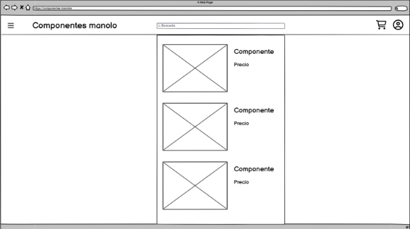

# 1º Análisis de requisitos y objetivos del proyecto:

**Requisitos Funcionales:**

  1º Menu desplegable:
  - Tiene que mostrar los componentes disponibles en la tienda
  - Tiene que ser intuitivo y fácil de usar

  2º Barra de busqueda:
  - Barra de busqueda en el header centrada que te permita buscar los diferentes tipos de productos

  3º Carrito:
  - imagend e un carrito que al clickarla te rediriga a la pagina del carrito con todos los productos añadidos por el usuario.

  4º Usuario:
  - Imagen de usuario que te redirigha a la pagina para iniciar sesion o registrarte y una vez lo haga te mande al menu de usuario

  5º Catalogo de productos:
  - Tiene que mostrar las fotos de los productos, su nombre y producto, ademas de haber un boton que te lleve a la cesta, y cuando clike el nombre o la foto del producto me lleve a su pagina donde vendran todas las caracteristicas

  6º Diseño adaptable:
  - El diseño de la pagina se debe adaptar a la vista de otros dispositivos o tamaños de pantaña

  7º Footer:
  - Pie de pagina con informacion sobre la empresa (aviso legal, redes sociales, entre otra informacion util.)

**Requisitos no funcionales:**

  1º Compatibilidad:
  - Compatible con los diferentes tipos de navegadores
  - Compatible con diferentes tipos de resolucion

  2º Rendimiento:
  - Debe estar optimizado para cargar rapido las paginas

  3º Mantenimiento:
  - El codigo debe estar limpio y organizado

**Tecnologias seleccionadas**

  HTML
  - Esencial para la creacion de cualquier pagina web, algunas de las ventaja que ofrecen son:
    - Sintaxis facil de entender y estructura simple.
    - Lenguaje estandar y compatibles con todos lo navegadores.
    - Facil de aprender.
   
  CSS
  - Esencial para el diseño de cualquier pagina web, algunas de sus ventajas son:
    - Cracion de diseños adaptables a la resolucion
    - Editar el diseño sin la necesidad de tocar el HTML, dejando este aun mas limpio
   
  Herramientas de desarrollo:
  - IDE: Visual Studio Code - Por su compatibilidad con HTML y CSS a travez de una facil instalacion de las extensiones disponibles, personalizacion, facil de usar e intuitivo
  - Validador: Validador de W3C - Que permitia comprobar la entandarizacion del codigo
  - Sistema de control de versiones: GitHub - Que permite llevar un control del progreso del proyecto y sus cambios

# 2º Creación de un wireframe en Balsamiq:

1º Pagina principal

Se decide agregar tambien una seccion donde mostras los producctos que se encuentran de oferta y el footer con la informacion necesaria.

2º Pestaña del producto

Se decide al final realizar un cambio dejando en el lado derecho los productos recomendados y abajo la descripcion y caracteristicas del producto.

3º Pestaña del producto

Al final se decide cambiar el recuadro para en vez de englobar todos los produtos englobe cada producto un recuadro diferente, ademas de añadir un boton para retirar del carrito el producto.

4º Pestaña de incio de sesion

Se crea tambien una variante para el registro de nuevos usuarios

5º Pestaña de usuario

Se decide que cada opcion este recuadrada y sea despregable, en la seccion pedido se añaden la fecha en la que se realizo y un boton para gestionar incidencias, y se cambian la opcion de otros ajustes por metodos de pago

# 3º Estructura HTML planificada:
